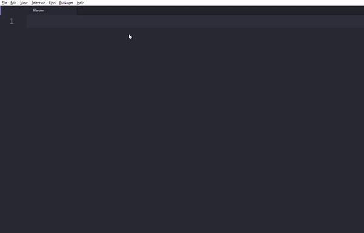

# autocomplete-curam Atom Package

UIM tag autocomplete package for Atom text editor.

## Features

* Autocomplete UIM element tags
* Autocomplete suggestions include brief description of element and link to IBM development guide for more information
* Fills tags with required attributes
* Use tab button to navigate to next generated attribute

## Installation and Set Up

* [Download Atom text editor](https://atom.io/)
* Add autocomplete-curam package (File -> Settings -> Install)
* Add autoclose-html-plus package (Automatically closes open HTML/XML tags)

## Use

* Open a UIM file in Atom
* Indicate `text.xml` grammar type by typing <kbd>CTRL</kbd> <kbd>SHIFT</kbd> <kbd>L</kbd> and searching "XML"
* Begin editing UIM files!

- - - -

Built off of the [atom-autocomplete-boilerplate](https://atom.io/packages/autocomplete-boilerplate) package
